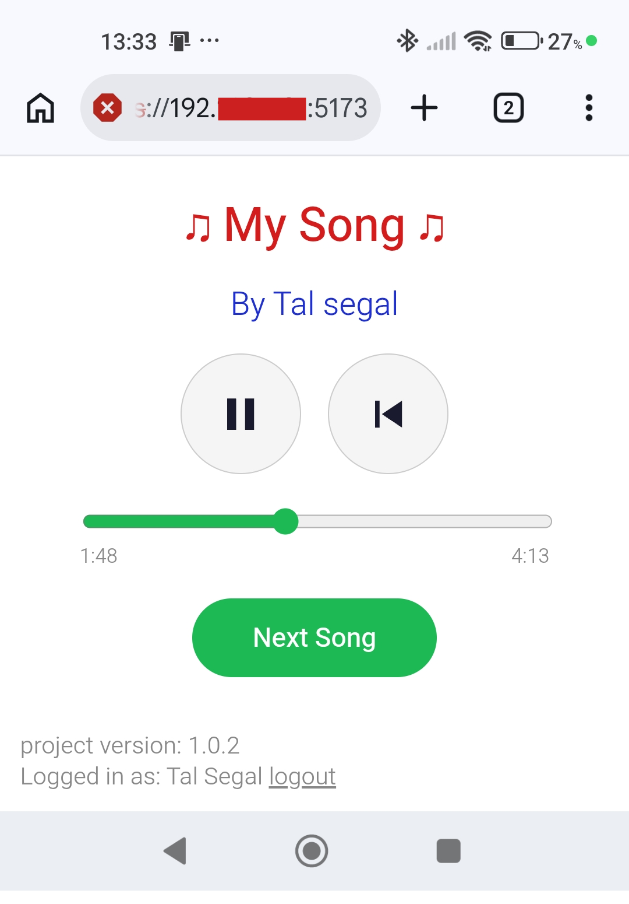
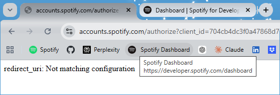

# 🎶 Music Cards Player




> The companion player for the music **guessing game** — scan a card's QR code and the song plays right in your browser, no Spotify app, no spoilers.

## 📖 About

**Music Cards Player** is the in-browser "DJ" for the guessing game built around the **[Music Cards](https://github.com/talseg/music-cards)** project.

Once you've printed your deck, this app turns any phone or laptop into the player for the table:

1. **Log in** with Spotify (a one-time, browser-only login).
2. Tap **Next Song** to open your camera and **scan a card's QR code**.
3. The track starts playing **inside the app** — full song, straight to your speakers.

The whole point is that it stays **blind**: scanning a card with an ordinary QR scanner opens Spotify and shows the song's title, artist, and artwork — giving the answer away. This player hides all of that. Players just hear the song, guess its title, artist, and release year, then flip the card to check.

---

## 🎮 Features

- 📷 **Scan to play** — point your device camera at a card's QR code and the song starts automatically.
- 🎧 **In-browser playback** — full tracks play through the Spotify Web Playback SDK; the Spotify app never opens, so the title and artist stay hidden.
- 🙈 **Blind by design** — song details are hidden for the guessing game (a debug flag can reveal them for testing).
- ⏯️ **Player controls** — play / pause, restart from the beginning, and a seek bar to scrub through the track.
- ⏭️ **Next Song** — stops the current track and reopens the scanner for the next card.

---

## 🚀 Getting Started

<details>
<summary><strong>✅ Prerequisites</strong></summary>

<br>

- A paid **[Spotify Premium](https://open.spotify.com/)** account (required by the Web Playback SDK).
- A device with a **camera** for scanning QR codes (a phone works great).
- **[Git](https://git-scm.com/)**
- **[Node.js LTS](https://nodejs.org/)**

</details>

<details>
<summary><strong>🟢 Spotify Developer setup</strong></summary>

<br>

1. Sign in to the **[Spotify Developer Dashboard](https://developer.spotify.com/dashboard)**.
2. **Create app** — fill in any App name and description.
3. Copy the **Client ID** (you'll need it for `.env`). You do **not** need the Client Secret — this app uses the browser-only PKCE flow.
4. Under **Redirect URIs**, add both of these (replace `<your-ip-address>`):
   - `https://<your-ip-address>:5173/callback` &nbsp;(for `npm run dev`)
   - `https://<your-ip-address>:4173/callback` &nbsp;(for `npm run preview`)
5. Under **Which API/SDKs are you planning to use?**, check **Web API** and **Web Playback SDK**.
6. Be sure to scroll down and click **Save**.
7. Open the **User Management** tab and add the name + email of every Spotify account that will use the app.
8. <a name="redirect-uri-error"></a>⚠️ **If login fails with the error below**, it means the address you're browsing from — `https://<your-ip-address>:<port>/callback` — is missing from the **Redirect URIs** list:

   

   **To fix it**, add that exact `/callback` URI in the [Spotify Developer Dashboard](https://developer.spotify.com/dashboard) under **Redirect URIs** and click **Save**. You can find your current IP address with:

   ```bash
   ipconfig | findstr IPv4
   # IPv4 Address. . . . . . . . . . . : <this-is-your-ip-address>
   ```

   **Why this keeps happening:** without a specific configuration, a device usually starts with a **different IP address after every reboot** (the router hands out addresses dynamically) — which silently invalidates the Redirect URI you registered. The lasting solution is to pin your device to a fixed IP, in one of two ways: a **router reservation** (recommended — the router always gives your device the same address) or a **manual static IP on the device**. Search the web for **"set a static ip address on your device"** for step-by-step guides.

</details>

<details>
<summary><strong>🛠️ Project setup</strong></summary>

<br>

**1. Clone and install**

```bash
git clone https://github.com/talseg/music-cards-player.git
cd music-cards-player
npm install
```

**2. Create a `.env` file in the project root** (next to `package.json` — **not** inside `src/`):

```bash
# Spotify — required
VITE_SPOTIFY_CLIENT_ID=your_spotify_client_id
```

> 🔐 That single value is all you need. There's **no** client secret: the app authenticates with Spotify's PKCE flow, which runs entirely in the browser — nothing is read or stored server-side.

</details>

### ▶️ Running the app

```bash
# Development
npm run dev        # → https://<your-ip-address>:5173

# Production preview
npm run build
npm run preview    # → https://<your-ip-address>:4173
```

> ℹ️ The app runs over **HTTPS** with a self-signed certificate, so your browser will show a security warning on first visit, don't worry - accept it to continue. HTTPS is also what lets the browser grant **camera** access for scanning.
>
> 🚫 Open it via your **IP address**, not `https://localhost:5173` — that's the address registered as a Spotify Redirect URI, and it lets you reach the app from a phone on the same network.

---

## 🕹️ Usage & Tips

- **Log in first** — playback needs a signed-in **Spotify Premium** account. The login is a one-time browser redirect; your session is remembered between visits.

- **Scan to start a song** — tap **Next Song** to open the camera, then point it at a card's QR code. The track starts playing on its own — no need to tap play.

- **Controls** — use **play / pause**, the **restart** button (jump back to the start of the song), and the **seek bar** to scrub to any point in the track.

- **Moving on** — **Next Song** stops whatever is playing and reopens the scanner, ready for the next card.

- **Use a phone** — the player works well on a phone held up to the deck. Allow **camera** and **audio** when the browser prompts you.

- **Keep it blind** — the player deliberately hides the song's title, artist, and year so players can guess. Only reach for a regular QR scanner if you actually want to open the song in Spotify and reveal the answer.

- **Reveal answers (for testing)** — set `IS_DEBUG` to `true` near the top of [`src/App.tsx`](./src/App.tsx) to show each song's name, artist, and year on screen. Leave it `false` for the real "blind" game experience.

- **Login fails with a `redirect_uri` error?** — most of the time this is solved by [this ⚠️ tip](#redirect-uri-error): your device's IP address changed, so the Redirect URI in the Spotify dashboard needs updating.

---

## 📜 License

This project is released under the [MIT License](./LICENSE).

- ✅ Free for personal use, learning, and contributions.
- 🚫 Not allowed: publishing as an app on Google Play, Apple App Store, or similar platforms.

🤝 **Want to contribute?** I'd be happy to have you on board — email **[talseg7@gmail.com](mailto:talseg7@gmail.com)** and we'll take it from there.

---

## ⚠️ Disclaimer

- **Non-commercial hobby project.** Music Cards is a personal, non-commercial project provided "as is", for personal use only. Generated cards are **not for resale**.
- **Not affiliated with Spotify.** This is an independent project, not affiliated with, endorsed by, or sponsored by Spotify. "Spotify" is a trademark of Spotify AB. Use of the Spotify API is subject to Spotify's [Developer Terms](https://developer.spotify.com/terms) and Design Guidelines.
- **No music is hosted or distributed.** The app stores and streams no audio of its own. Playback happens through your own Spotify account via Spotify's official Web Playback SDK. All music and related rights remain with their respective owners.
- **Independent design.** This is an original, independently built project. No third-party names, logos, branding, or song selections are used.
- **Your responsibility.** You are responsible for your own use of the app, including complying with Spotify's terms and any applicable laws.
- **Not legal advice.** This notice is provided for transparency and does not constitute legal advice.

---

## 🙏 Acknowledgments

- Built by **Tal Segal** with React, TypeScript, and [Vite](https://vitejs.dev/).
- Developed with the help of **Anthropic Claude**.

---
